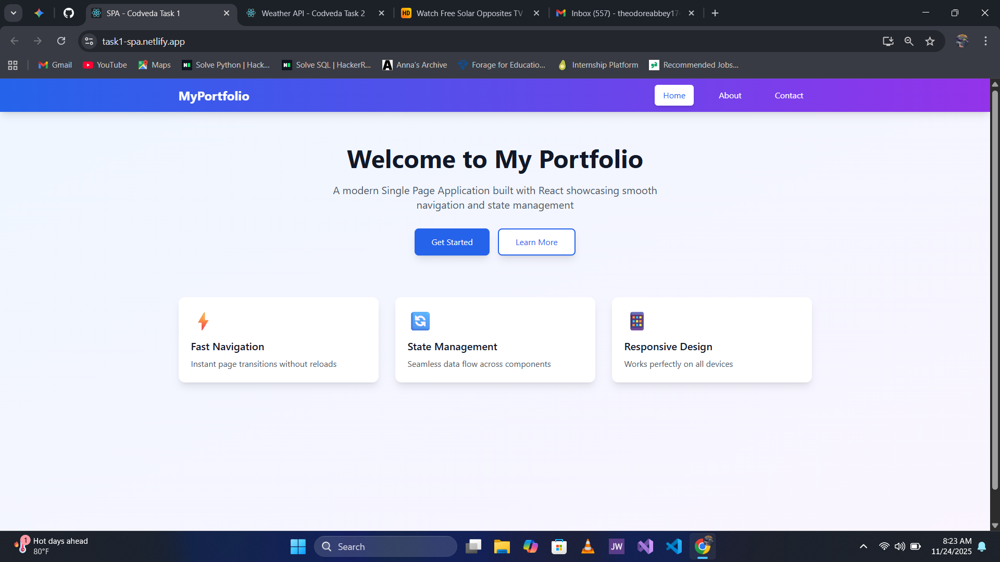
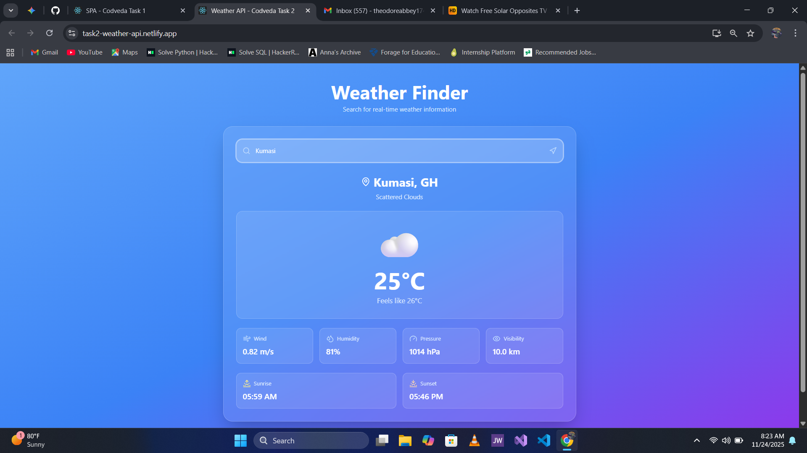
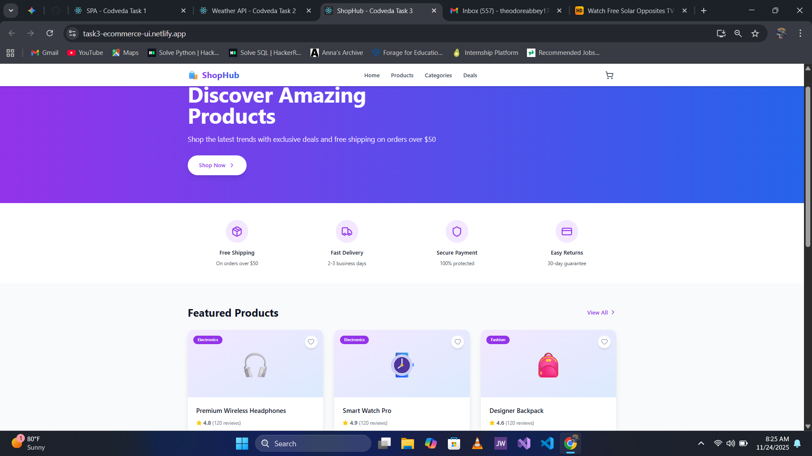

# Codveda Technology - Front-End Development Internship
## Level 2 Tasks Portfolio


## 👨‍💻 About This Repository

This repository contains my completed Level 2 tasks for the **Codveda Technology Front-End Development Internship Program**. It showcases three intermediate-level projects demonstrating modern web development practices, API integration, and responsive design principles.

## 📋 Table of Contents

- [Projects Overview](#projects-overview)
- [Technologies Used](#technologies-used)
- [Installation Guide](#installation-guide)
- [Project Details](#project-details)
- [Key Learning Outcomes](#key-learning-outcomes)
- [Live Demos](#live-demos)
- [Screenshots](#screenshots)
- [Contact](#contact)

## 🚀 Projects Overview

### Task 1: Single Page Application (SPA) ⚛️
A modern Single Page Application built with React featuring smooth navigation, state management, and three distinct pages (Home, About, Contact) without page reloads.

**Key Features:**
- Client-side routing with React Context API
- Responsive navigation with mobile menu
- Smooth page transitions
- State persistence across pages
- Interactive contact form

**Tech Stack:** React, Context API, Tailwind CSS, Lucide React

---

### Task 2: REST API Integration 🌤️
A dynamic weather application that integrates with the OpenWeatherMap API to fetch and display real-time weather data with optimized search functionality.

**Key Features:**
- Real-time weather data fetching
- Debounced search (800ms delay)
- Comprehensive weather metrics
- Error handling and loading states
- Dynamic weather icons
- Sunrise/Sunset times

**Tech Stack:** React, OpenWeatherMap API, Fetch API, Tailwind CSS, Lucide React

---

### Task 3: CSS Framework Implementation 🛍️
A fully responsive e-commerce UI built with Tailwind CSS, showcasing modern design patterns, custom theming, and interactive components.

**Key Features:**
- Responsive product catalog
- Shopping cart functionality
- Favorite/wishlist system
- Mobile-first design
- Custom gradient themes
- Smooth animations and transitions

**Tech Stack:** React, Tailwind CSS, Lucide React, CSS Grid/Flexbox

## 🛠️ Technologies Used

| Category | Technologies |
|----------|-------------|
| **Frontend Framework** | React 18.x |
| **Styling** | Tailwind CSS 3.x |
| **State Management** | React Hooks, Context API |
| **Icons** | Lucide React |
| **API Integration** | Fetch API, OpenWeatherMap |
| **Build Tool** | Create React App |
| **Deployment** | Vercel, Netlify |

## 📦 Installation Guide

### Prerequisites
- Node.js (v14 or higher)
- npm or yarn package manager
- Git

### Clone the Repository
```bash
git clone https://github.com/your-username/codveda-level2-tasks.git
cd codveda-level2-tasks
```

### Task 1: SPA Setup
```bash
cd task1-spa
npm install
npm install lucide-react
npm start
```

### Task 2: Weather API Setup
```bash
cd task2-weather-api
npm install
npm install lucide-react

# Create .env file and add your API key
echo "REACT_APP_WEATHER_API_KEY=your_api_key_here" > .env

npm start
```

### Task 3: E-commerce UI Setup
```bash
cd task3-ecommerce-ui
npm install
npm install -D tailwindcss postcss autoprefixer
npm install lucide-react
npx tailwindcss init -p
npm start
```

## 📂 Project Structure

```
Codveda-Internship-Project-Intermediate/
├── task1-spa/
│   ├── src/
│   ├── public/
│   ├── package.json
│   └── README.md
├── task2-weather-api/
│   ├── src/
│   ├── public/
│   ├── .env.example
│   ├── package.json
│   └── README.md
├── task3-ecommerce-ui/
│   ├── src/
│   ├── public/
│   ├── tailwind.config.js
│   ├── package.json
│   └── README.md
└── README.md (this file)
```

## 📖 Project Details

### Task 1: Single Page Application

**Objectives Achieved:**
✅ Implemented React Router for navigation  
✅ Used Context API for state management  
✅ Created smooth page transitions  
✅ Deployed on Vercel  
✅ Fully responsive design  

**Deployed URL:** [[Your Netlify URL](https://task1-spa.netlify.app/)]

---

### Task 2: REST API Integration

**Objectives Achieved:**
✅ Integrated OpenWeatherMap API  
✅ Implemented debounced search queries  
✅ Handled loading and error states  
✅ Displayed dynamic content  
✅ Optimized API call performance  

**API Used:** OpenWeatherMap API v2.5

---

### Task 3: CSS Framework

**Objectives Achieved:**
✅ Utilized Tailwind CSS utility classes  
✅ Customized default theme  
✅ Ensured responsive design  
✅ Maintained consistent design language  
✅ Optimized for accessibility  

**Framework:** Tailwind CSS v3.x

## 🎯 Key Learning Outcomes

Through these projects, I gained hands-on experience with:

1. **React Development**
   - Component-based architecture
   - Hooks (useState, useEffect, useContext)
   - State management patterns
   - Event handling

2. **API Integration**
   - RESTful API consumption
   - Asynchronous JavaScript
   - Error handling
   - Performance optimization with debouncing

3. **Responsive Design**
   - Mobile-first approach
   - CSS Grid and Flexbox
   - Media queries
   - Cross-browser compatibility

4. **Modern CSS**
   - Utility-first CSS with Tailwind
   - Custom theming
   - Animations and transitions
   - Design systems

5. **Deployment**
   - Git version control
   - CI/CD with Vercel
   - Environment variables
   - Production optimization

## 🌐 Live Demos

| Project | Live Demo | Source Code |
|---------|-----------|-------------|
| Task 1 - SPA | [Demo Link](https://task1-spa.netlify.app/) | [View Code](./task1-spa) |
| Task 2 - Weather API | [Demo Link](#) | [View Code](./task2-weather-api) |
| Task 3 - E-commerce UI | [Demo Link](https://task3-ecommerce-ui.netlify.app/) | [View Code](./task3-ecommerce-ui) |

## 📸 Screenshots

### Task 1: Single Page Application


### Task 2: Weather Application


### Task 3: E-commerce UI


## 🚀 Deployment Instructions

### Deploying on Vercel

1. **Via GitHub (Recommended)**
   ```bash
   # Push your code to GitHub
   git add .
   git commit -m "Complete Level 2 tasks"
   git push origin main
   
   # Go to vercel.com
   # Import your repository
   # Deploy!
   ```

2. **Via Vercel CLI**
   ```bash
   npm install -g vercel
   vercel login
   vercel
   ```

### Deploying on Netlify

1. Push code to GitHub
2. Go to [Netlify](https://netlify.com)
3. Click "New site from Git"
4. Select your repository
5. Configure build settings:
   - Build command: `npm run build`
   - Publish directory: `build`
6. Deploy!

## 🎓 Internship Program Details

**Program:** Front-End Development Internship  
**Company:** Codveda Technology  
**Level:** 2 (Intermediate)  
**Duration:** 15 Days  
**Tasks Completed:** 3/3  

## 📝 Submission Checklist

- [x] Completed 3 out of 4 Level 2 tasks
- [x] Created individual README files for each task
- [x] Deployed projects online
- [x] Updated LinkedIn with project achievements
- [x] Created video demonstration
- [x] Pushed code to GitHub
- [x] Tagged @Codveda in social media posts
- [x] Used hashtags: #CodvedaJourney #CodvedaExperience #FutureWithCodveda

## 🤝 Contributing

This is an internship project, but feedback and suggestions are welcome! Feel free to:
- Open an issue for bugs or improvements
- Submit a pull request
- Star the repository if you find it helpful

## 📄 License

This project is created for educational purposes as part of the Codveda Technology internship program. Feel free to use the code for learning purposes.

## 🙏 Acknowledgments

- **Codveda Technology** - For providing this amazing learning opportunity and mentorship
- **React Team** - For the powerful React framework
- **Tailwind Labs** - For the excellent Tailwind CSS framework
- **OpenWeatherMap** - For the free weather API

## 📧 Contact & Connect

I'm always excited to connect with fellow developers and discuss web development!

- **LinkedIn:** [My LinkedIn Profile](https://linkedin.com/in/theodore-abbey)
- **GitHub:** [My GitHub Profile](https://github.com/theodoreabbey173)
- **Email:** theodoreabbey174@gmail.com
- **Portfolio:** [My Portfolio Website](https://your-portfolio.com)

## 🏷️ Tags

`#CodvedaJourney` `#CodvedaExperience` `#FutureWithCodveda` `#ReactJS` `#WebDevelopment` `#FrontendDevelopment` `#InternshipProject` `#JavaScript` `#TailwindCSS` `#APIIntegration` `#ResponsiveDesign` `#ModernWebDev`

---

## 📊 Repository Stats


---

**Made with ❤️ during my Front-End Development Internship at Codveda Technology**
